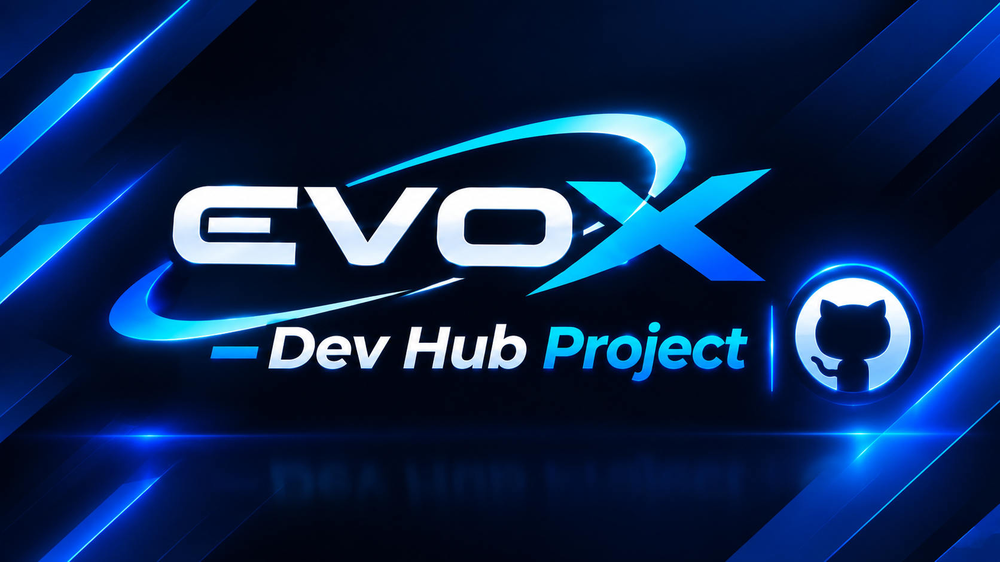

  

  <h1>🚀 Evox Dev Hub Project</h1>

  
<b>Evox Dev Hub Project</b> est un hub/portfolio Single Page Application (SPA) ultra-modulaire, moderne et dynamique. Conçu avec une architecture propre, il permet à tout développeur ou créateur de générer sa propre vitrine de projets responsive avec mode Sombre / Dark Theme.

  
L'ensemble du contenu (profil, catégories, projets, réseaux sociaux) est entièrement piloté par des fichiers de configuration <b>JSON</b> localisés dans <code>/web/config/</code> et modifiables via une interface graphique <b>Python GUI (Tkinter)</b> intuitive.

<h2>✨ Fonctionnalités Principales</h2>

<table>
  <thead>
    <tr>
      <th>Fonctionnalité</th>
      <th>Description</th>
    </tr>
  </thead>
  <tbody>
    <tr>
      <td><b>Interface Dark-Mode</b></td>
      <td>UI épurée construite en HTML5, CSS moderne avec conteneurs sécurisés et typographie claire.</td>
    </tr>
    <tr>
      <td><b>Intégration API GitHub</b></td>
      <td>Récupération en temps réel des métriques utilisateur (dépôts publics, followers) et des favoris sans restriction.</td>
    </tr>
    <tr>
      <td><b>Recherche & Filtrage</b></td>
      <td>Filtrage instantané par mots-clés, catégories ou tags, combiné à un sélecteur de tri intelligent.</td>
    </tr>
    <tr>
      <td><b>Commutateur de Vue</b></td>
      <td>Basculez instantanément entre la <b>Vue Grille</b> et la <b>Vue Liste</b>.</td>
    </tr>
    <tr>
      <td><b>Aperçu Markdown</b></td>
      <td>Affichage interactif des README.md via conversion automatique des liens et images vers les serveurs Raw.</td>
    </tr>
    <tr>
      <td><b>Studio de Gestion</b></td>
      <td>Application desktop Python pour effectuer les opérations CRUD sur les fichiers JSON.</td>
    </tr>
  </tbody>
</table>

<h2>📁 Arborescence du Projet</h2>

<pre>
Evox-Dev-Hub-Project/
├── assets/
│   └── banner.png             # Bannière d'en-tête du README
├── index.html                 # Point d'entrée principal de l'application Web
└── web/
    ├── css/
    │   └── style.css          # Feuille de style principale (variables, responsive)
    ├── js/
    │   └── app.js             # Logique applicative, routeur et appels API GitHub
    └── config/
        ├── profile.json       # Métadonnées du profil utilisateur
        ├── categories.json    # Liste des catégories et icônes
        ├── projects.json      # Projets mis en avant
        ├── socials.json       # Liens de réseaux sociaux
        └── script_gui_python.py # Studio GUI Python Tkinter pour gérer les JSONs
</pre>

<h2>⚙️ Explications des Fichiers de Configuration JSON</h2>

Tous les fichiers de données se situent dans le dossier <code>/web/config/</code>.

<h3>1. <code>profile.json</code></h3>

Définit les informations personnelles affichées sur l'en-tête.

<pre><code>{
  "username": "nexgen999",
  "handle": "nexgen999",
  "avatar": "",
  "bio": "I love Releases & PS5 Homebrew Development",
  "stats": {
    "repos": 128,
    "followers": 69
  }
}</code></pre>

<h3>2. <code>categories.json</code></h3>

Définit la liste des filtres et les catégories pour classer vos travaux.

<pre><code>[
  {
    "id": "all",
    "name": "Tous",
    "icon": "fa-solid fa-border-all"
  },
  {
    "id": "ps5",
    "name": "PS5 / PlayStation",
    "icon": "fa-brands fa-playstation"
  },
  {
    "id": "web",
    "name": "Web / Store",
    "icon": "fa-solid fa-globe"
  }
]</code></pre>

<h3>3. <code>projects.json</code></h3>

Contient la liste de vos projets locaux personnalisés.

<pre><code>[
  {
    "id": "evox-coreos",
    "title": "evoX-CoreOS",
    "category": "ps5",
    "description": "Écosystème automatisé et intelligent pour PlayStation 5.",
    "images": [],
    "github": "",
    "demo": "",
    "tags": ["PS5", "Payloads", "Store"]
  }
]</code></pre>

<h3>4. <code>socials.json</code></h3>

Gère les icônes et liens de réseaux sociaux affichés sur le profil.

<pre><code>[
  {
    "name": "GitHub",
    "url": "",
    "icon": "fa-brands fa-github"
  },
  {
    "name": "Discord",
    "url": "",
    "icon": "fa-brands fa-discord"
  }
]</code></pre>

<h2>🚀 Démarrage Rapide</h2>

<h3>Lancer le Hub Web en local</h3>

Vous pouvez héberger le projet avec n'importe quel serveur web statique ou via Python :

<pre><code>python -m http.server 8000</code></pre>

Rendez-vous ensuite sur <code>http://localhost:8000</code>.

<h3>Lancer l'Éditeur Python GUI</h3>

Pour modifier vos projets et configurations sans toucher au code, utilisez le studio intégré :

<pre><code>cd web/config
python script_gui_python.py</code></pre>

<h2>📄 Licence</h2>

Ce projet est sous licence <b>MIT</b>. Vous êtes libre de le forker, de le modifier et de l'adapter pour votre propre portfolio.

